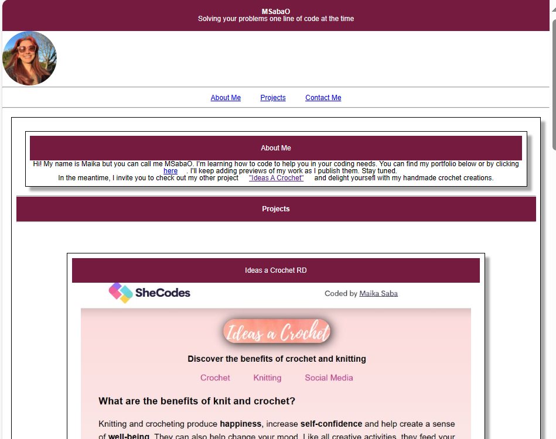

# bootcamp2023-Challenge2

## Description

This challenge was completed to demonstrate the use what I have learned of advance CSS in week #2 of the UNB Coding Bootcamp.

In this opportunity I was able create the first version of my own porfolio by using the tools provided in the first 2 weeks of class. Organize and merge some of the CSS elements and play around with the responsiveness.

Unfortunately, I was not able to make it fully functional and I will try another attempt later.

## Installation

To access the webpage, please follow this link in a web browser: https://msabao.github.io/bootcamp2023-Challenge2/

## Usage

In this webpage you can jump directly to each section by clicking on the top right items and if accessibility is enable in your device you will be able to get a description of each of the pictures.

## License

MIT License

Copyright (c) 2023 Maika Saba

Permission is hereby granted, free of charge, to any person obtaining a copy
of this software and associated documentation files (the "Software"), to deal
in the Software without restriction, including without limitation the rights
to use, copy, modify, merge, publish, distribute, sublicense, and/or sell
copies of the Software, and to permit persons to whom the Software is
furnished to do so, subject to the following conditions:

The above copyright notice and this permission notice shall be included in all
copies or substantial portions of the Software.

THE SOFTWARE IS PROVIDED "AS IS", WITHOUT WARRANTY OF ANY KIND, EXPRESS OR
IMPLIED, INCLUDING BUT NOT LIMITED TO THE WARRANTIES OF MERCHANTABILITY,
FITNESS FOR A PARTICULAR PURPOSE AND NONINFRINGEMENT. IN NO EVENT SHALL THE
AUTHORS OR COPYRIGHT HOLDERS BE LIABLE FOR ANY CLAIM, DAMAGES OR OTHER
LIABILITY, WHETHER IN AN ACTION OF CONTRACT, TORT OR OTHERWISE, ARISING FROM,
OUT OF OR IN CONNECTION WITH THE SOFTWARE OR THE USE OR OTHER DEALINGS IN THE
SOFTWARE.

---
